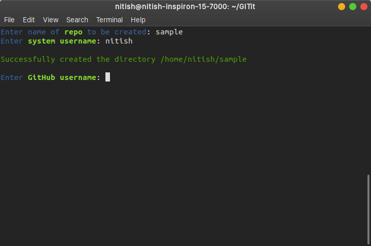
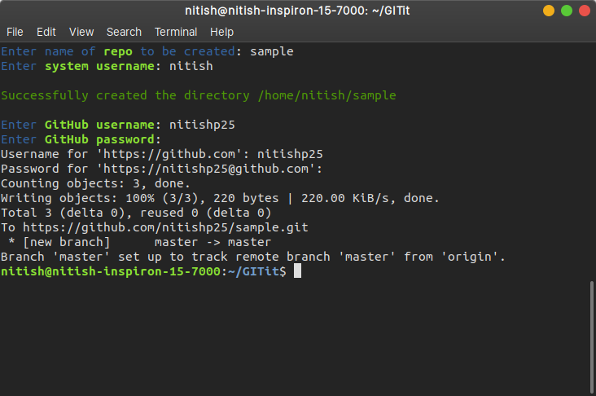

# GITit

A simple CLI tool to automate repo creation and initialization.

## Tools
- Python3
- Click
- PyGitHub
- gitpython

## How It Works
 - Creates local directory for the repository
 - Adds README file in the directory
 - Initializes git, adds files, commits changes
 - Creates GitHub repository of same name
 - Pushes commits to the Github repo
 - Viola! You can now skip straight to the development of your project!

  

## Usage
### 1. Installation
```bash
git clone https://github.com/nitishp25/GITit
```
```bash
cd GITit
```
### 2. Get Dependencies
```bash
pip install -r requirements.txt
```
### 3. Run Script
```bash
python3 main.py
``` 
